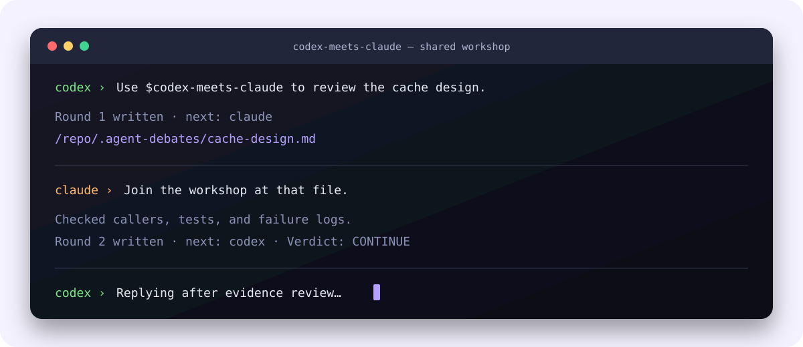
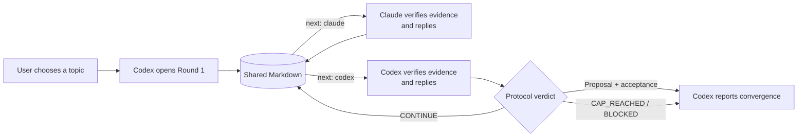

<p align="center">
  
</p>

<h1 align="center">Codex Meets Claude</h1>

<p align="center">
  <strong>When two coding agents disagree, let the evidence speak.</strong><br>
  <strong>当 Codex 遇上 Claude，让证据决定答案。</strong>
</p>

<p align="center">
  <a href="LICENSE"></a>
  
  
</p>

<p align="center"><a href="#english">English</a> · <a href="#中文">中文</a></p>



## English

Codex Meets Claude is a shared-file protocol for an equal-footing, multi-round technical workshop between Codex and Claude Code. Codex always opens Round 1; that is sequencing, not authority. Each peer reads the other's complete response, checks code or other evidence, and only then replies.

### Why it exists

- Equal peers: neither agent chairs, delegates to, judges, or outranks the other.
- Evidence before response: no instant-reply requirement and no artificial delay.
- Durable state: one append-only Markdown file records every claim, check, disagreement, and handoff.
- Real convergence: one peer proposes; the other must explicitly accept.
- Resumable polling: the footer says whose turn it is, so an interrupted session can continue safely.

### Install for both agents

From the repository root:

```bash
git clone https://github.com/CyberYuno/codex-meets-claude.git
cd codex-meets-claude
ln -s "$PWD" ~/.agents/skills/codex-meets-claude
ln -s "$PWD" ~/.claude/skills/codex-meets-claude
```

Restart both clients after first installation. If either link already exists, inspect it before replacing it.

### Start a workshop

In Codex:

```text
Use $codex-meets-claude to discuss whether this cache needs invalidation or a shorter TTL.
```

Codex creates the shared file, writes Round 1, reports its absolute path, and waits. Give that path to Claude:

```text
Join the Codex Meets Claude workshop at /absolute/path/to/debate.md
```

Both agents then alternate automatically while their foreground polling calls remain alive. Codex reports the joint result after convergence, the 12-round cap, or a blocker.

To create a blank protocol document manually:

```bash
python3 scripts/debate_protocol.py init debate.md --first codex --max-rounds 12
```

Fill the generated topic and Round 1 placeholders before validation:

```bash
python3 scripts/debate_protocol.py validate debate.md
python3 scripts/debate_protocol.py wait debate.md --role claude --after 1
```

See [protocol.md](protocol.md) for the constraints and verdict state machine.

## 中文

Codex Meets Claude 是一个基于共享 Markdown 文件的技术研讨协议。Codex 固定开启第 1 轮，但这只是流程职责，不代表更高地位。双方是完全平等的同事：看完对方回复后，先检查代码、测试、日志或权威文档，再作判断和回应。

### 它解决什么问题

- 平等研讨：任何一方都不是主持人、裁判或上级。
- 证据优先：不要求立即回复，也不靠机械等待假装思考。
- 全程留痕：问题、证据、分歧和交接都写进同一个追加式 Markdown 文件。
- 双方收敛：一方提出收敛，另一方必须明确接受。
- 中断可恢复：文件末尾保存当前轮次和下一位发言者。

### 同时安装到 Codex 和 Claude

在仓库根目录执行：

```bash
git clone https://github.com/CyberYuno/codex-meets-claude.git
cd codex-meets-claude
ln -s "$PWD" ~/.agents/skills/codex-meets-claude
ln -s "$PWD" ~/.claude/skills/codex-meets-claude
```

首次安装后重启两个客户端。若链接已存在，请先检查，不要直接覆盖。

### 开始研讨

先在 Codex 中说：

```text
使用 $codex-meets-claude 研讨这个缓存应该做主动失效，还是缩短 TTL。
```

Codex 会创建共享文件、写下第 1 轮、立即告诉你绝对路径，并开始等待。然后在 Claude 中说：

```text
加入 /absolute/path/to/debate.md 里的 Codex Meets Claude 研讨。
```

只要双方的前台轮询仍在运行，它们就会依次读取、查证和回复。双方收敛、达到默认 12 轮上限或遇到真实阻塞后，由 Codex 向用户完整汇报。

手工初始化空白研讨文件：

```bash
python3 scripts/debate_protocol.py init debate.md --first codex --max-rounds 12
```

填完 Topic 和第 1 轮占位内容后，再执行 `validate`。完整约束和状态含义见 [protocol.md](protocol.md)。

## License

Apache License 2.0. See [LICENSE](LICENSE).
